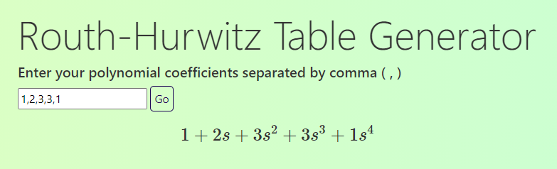
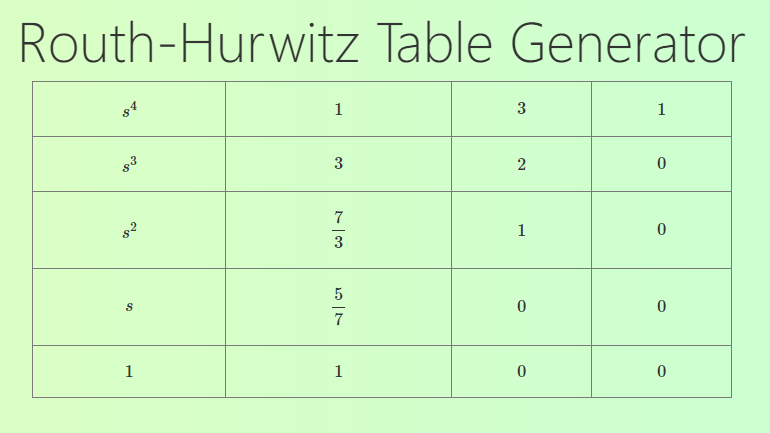
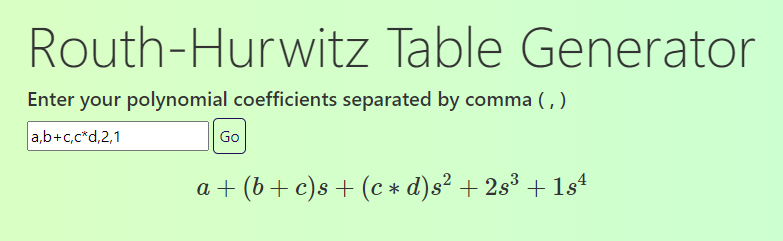
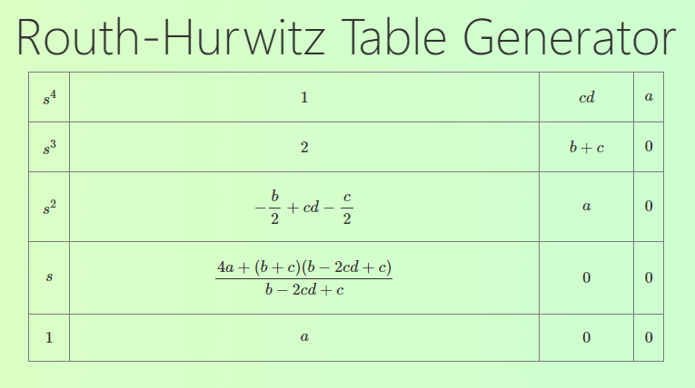

# Routh-Hurwitz Table Generator

The [Routh-Hurwitz Stability Criterion](https://en.wikipedia.org/wiki/Routh%E2%80%93Hurwitz_stability_criterion) states that any system can be stable if and only if all the roots of the second column have the same sign. The number of sign changes in the second column of the Routh-Hurwitz table is equal to the number of roots of the characteristic equation in the closed right half of the complex plane.

You can try out this tool without installation [here.](https://routhhurwitz.herokuapp.com/)

## Installation

Clone the repository and install the requirements from `requirements.txt` (Installation can be done inside a [virtualenv](https://docs.python.org/3/library/venv.html)):

```
pip install requirements.txt
```

Run the [Flask](https://flask.palletsprojects.com/en/1.1.x/) server:

```
python3 RouthHurwitzWeb.py
```

The server should then be live at `http://localhost:5000/`.

## Usage

Enter the coefficients of the polynomial, in ascending order of degree, separated by commas.



Hit "Go". This should generate a Routh-Hurwitz table. The number of sign changes along the second column represents the number of unstable roots (i.e roots with strictly positive real parts).



Add alphabets as variables in the coefficients.



The tool will leave answers simplified in terms of the given variables.

