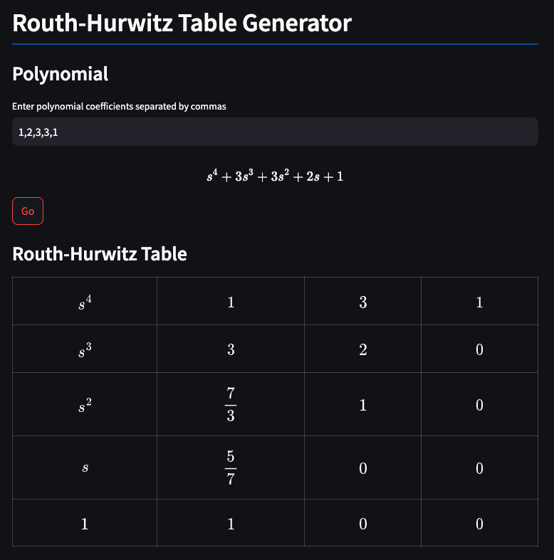

[](https://www.pcrf.net/)

[](https://www.pcrf.net/)

# Routh-Hurwitz Table Generator

<p align="center">
    <i>The <strong><a href="https://en.wikipedia.org/wiki/Routh%E2%80%93Hurwitz_stability_criterion">Routh-Hurwitz Stability Criterion</a></strong> states that any system can be stable if and only if all the roots of the second column have the same sign. The number of sign changes in the second column of the Routh-Hurwitz table is equal to the number of roots of the characteristic equation in the closed right half of the complex plane.</i>
</p>

## Try it out

You can try out this tool without installation [here.](https://routhhurwitz.streamlit.app/)

## Installation

### :one: Install Python 3.12+

Installation process may vary depending on OS. Refer to [this article](https://realpython.com/installing-python/) for installation instructions for your OS.

### :two: Install Poetry

Install [Poetry package manager](https://python-poetry.org/). Installation process may vary depending on OS.

### :three: Install Dependencies

Install dependencies:

```bash
poetry install
```

### :four: Run the App

Run the app using the following command:

```bash
streamlit run app.py
```

The app should then be running on `http://localhost:8501`.

## Usage

Enter the coefficients of the polynomial, in ascending order of degree, separated by commas:


Hit `Go`. This should generate a Routh-Hurwitz table. The number of sign changes along the second column represents the number of unstable roots (i.e roots with strictly positive real parts):



Add alphabets as variables in the coefficients. The tool will leave answers simplified in terms of the given variables:


## Comparing Alternatives

&nbsp; | [FSXAC/RHCalc](https://github.com/FSXAC/RHCalc) | [crclayton/routh-hurwitz-calc](https://github.com/crclayton/routh-hurwitz-calc) | [mohamedhassan279/Routh-Hurwitz-stability](https://github.com/mohamedhassan279/Routh-Hurwitz-stability) | [alvii147/RouthHurwitz](https://github.com/alvii147/RouthHurwitz)
--- | --- | --- | --- | ---
Deployed Publicly | :white_check_mark: | :white_check_mark: | :white_check_mark: | :white_check_mark:
Unlimited Polynomial Degree | :x: | :white_check_mark: | :white_check_mark: | :white_check_mark:
Programmatical Use | :x: | :x: | :x: | :white_check_mark:
Works with Variables | :x: | :x: | :x: | :white_check_mark:
